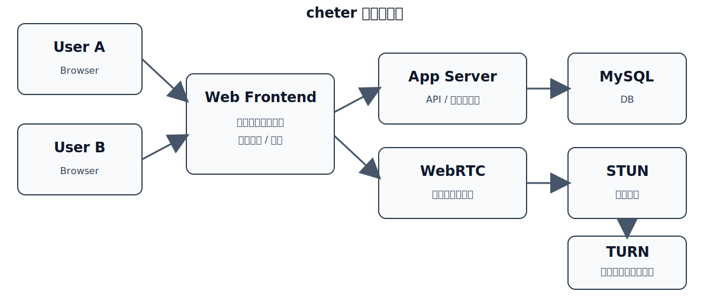
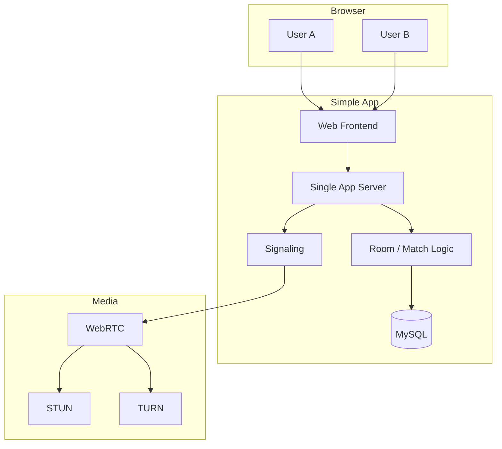

# cheter 構成図

cheter は、ブラウザで使う動画チャットアプリです。  
ユーザ同士が「待ち受け番号」を決めてマッチングし、WebRTC で音声・映像をやり取りします。

## 簡単な構成

## 役割

| コンポーネント | 役割 |
|---|---|
| Web Frontend | 待ち受け番号入力、通話画面、カメラ/マイク制御 |
| Single App Server | 画面表示、API、待ち受け番号管理をまとめて担当 |
| Room / Match Logic | 同じ番号のユーザ同士をつなぐ |
| Signaling | WebRTC の接続情報を交換する |
| MySQL | ルーム情報や簡単な履歴を保存する |
| WebRTC | 音声・映像の通信本体 |
| STUN / TURN | 通信が直結できないときの補助 |

## モジュール詳細

### Web Frontend

- ブラウザで動く画面を担当する
- 待ち受け番号の入力、接続待ち、通話画面を表示する
- カメラ・マイクの許可取得と ON/OFF を扱う
- WebSocket や API を通してサーバと通信する

### Single App Server

- 画面配信、API、簡単な状態管理をまとめて持つ
- 待ち受け番号の登録と検索を行う
- 相手が見つかったらルームを作る
- 認証を入れるならここでセッションも扱う

### Room / Match Logic

- 同じ待ち受け番号を持つユーザを 2 人1組にする
- すでに埋まっている番号は新規参加を待たせるか拒否する
- 退出や切断があったらルームを閉じる
- 身内利用なら Redis を使わず、アプリ内メモリでも始められる

### Signaling

- WebRTC 接続に必要な情報を交換する
- SDP offer / answer をやり取りする
- ICE candidate を相手に届ける
- 通話そのものは持たず、接続準備だけを担当する

### WebRTC

- ブラウザ同士の音声・映像通信を担う
- 基本は P2P 接続を試す
- 直結できないときは TURN を経由する
- 通信品質はネットワーク環境に左右される

### STUN

- ブラウザが外から見える自分の IP / ポートを確認する
- まず直結できるかを調べるために使う
- 通常は軽量で、TURN より負荷が小さい

### TURN

- 直結できないときに音声・映像を中継する
- NAT やファイアウォールが厳しい環境で使う
- 通信コストが高いので、必要なときだけ使う

### MySQL

- ルーム、参加者、接続履歴を保存する
- 身内向けでも扱いやすい一般的な RDB として使う
- 必要なら後からインデックスを追加しやすい
- 一時状態は持たず、消えて困るデータだけを保存する

## DB テーブル構成

身内向けの簡易構成なら、まずはこのくらいで十分です。
MySQL を前提にして、型はシンプルにしています。

### users

| カラム | 型 | 説明 |
|---|---|---|
| id | BIGINT UNSIGNED / CHAR(36) | ユーザID |
| display_name | VARCHAR(100) | 表示名 |
| created_at | DATETIME | 作成日時 |

### rooms

| カラム | 型 | 説明 |
|---|---|---|
| id | BIGINT UNSIGNED / CHAR(36) | ルームID |
| room_code | VARCHAR(32) | 待ち受け番号 |
| status | ENUM | `waiting` / `matched` / `closed` |
| created_at | DATETIME | 作成日時 |
| closed_at | DATETIME | 終了日時 |

### room_members

| カラム | 型 | 説明 |
|---|---|---|
| id | BIGINT UNSIGNED / CHAR(36) | レコードID |
| room_id | BIGINT UNSIGNED / CHAR(36) | 対象ルーム |
| user_id | BIGINT UNSIGNED / CHAR(36) | 参加ユーザ |
| role | ENUM | `host` / `guest` |
| joined_at | DATETIME | 参加日時 |
| left_at | DATETIME | 退出日時 |

### signaling_messages

| カラム | 型 | 説明 |
|---|---|---|
| id | BIGINT UNSIGNED / CHAR(36) | メッセージID |
| room_id | BIGINT UNSIGNED / CHAR(36) | 対象ルーム |
| sender_id | BIGINT UNSIGNED / CHAR(36) | 送信者 |
| message_type | ENUM | `offer` / `answer` / `candidate` |
| payload | JSON | SDP や ICE 情報 |
| created_at | DATETIME | 作成日時 |

### call_logs

| カラム | 型 | 説明 |
|---|---|---|
| id | BIGINT UNSIGNED / CHAR(36) | ログID |
| room_id | BIGINT UNSIGNED / CHAR(36) | 対象ルーム |
| event_type | ENUM | `started` / `ended` / `failed` |
| detail | TEXT | 補足情報 |
| created_at | DATETIME | 記録日時 |

## 処理の流れ

1. ユーザがブラウザから待ち受け番号を入力する。
2. App Server が同じ番号の相手を探す。
3. つながったら Signaling で接続情報を交換する。
4. WebRTC で音声・映像をやり取りする。
5. 直結できない場合だけ TURN を経由する。

## 補足

- 身内利用なら、まずは 1 台の App Server で十分。
- DB は MySQL で十分。
- 必要になったら Redis や監視を足していけばよい。
